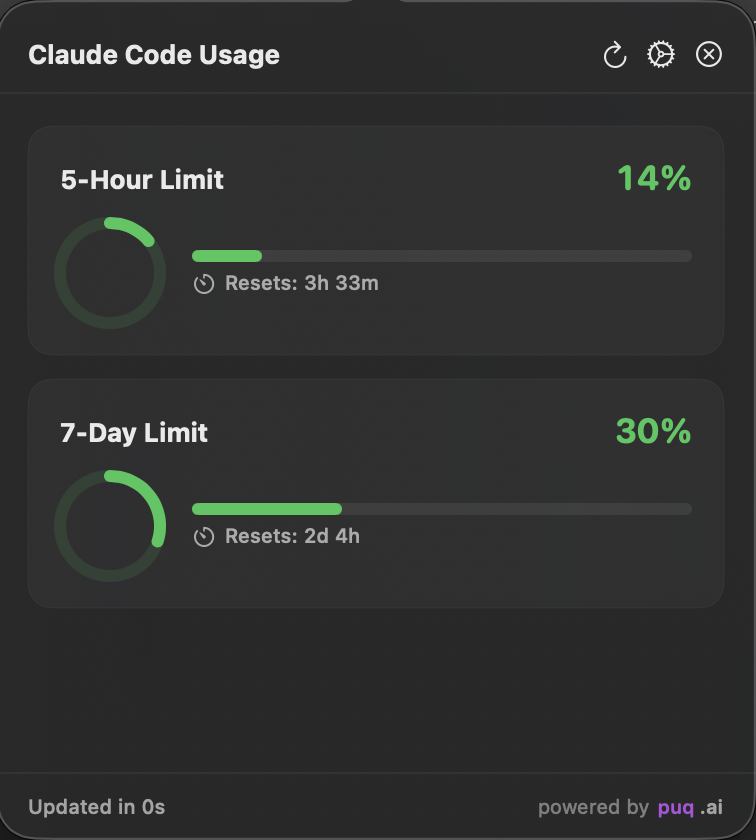
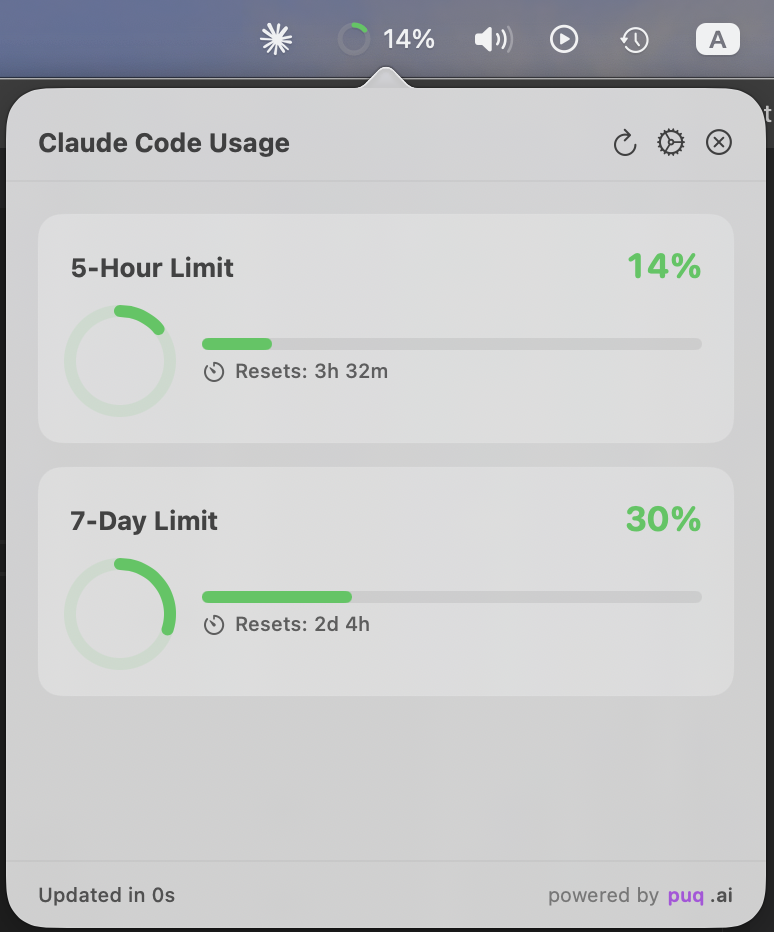

# ClaudeMeter

A macOS menu bar utility to monitor your Anthropic Claude Code usage, token consumption, and limits in real-time.

<p align="center">
  
  
</p>

## Features

- **Real-time Monitoring**: Tracks 5-hour, 7-day, and Opus-specific usage limits
- **Menu Bar Widget**: Shows current utilization at a glance (Icon, Compact, or Detailed modes)
- **Notifications**: Configurable alerts when approaching limits (75%, 90%, 95%)
- **Smart Polling**: Adaptive refresh rate based on activity and usage level
- **Offline Caching**: View last known usage even when offline
- **Native macOS**: Built with SwiftUI for minimal resource footprint

## Requirements

- macOS 13.0 (Ventura) or later
- Xcode 15.0+ (for building from source)
- Claude Code CLI authenticated (`claude login`)

## Installation

### Download Release

1. Download the latest release from the [Releases](https://github.com/puq-ai/claude-meter/releases) page
2. Unzip `ClaudeMeter.app`
3. Drag to your Applications folder
4. Launch the app

### Build from Source

```bash
# Clone the repository
git clone https://github.com/puq-ai/claude-meter.git
cd ClaudeMeter

# Build the app
xcodebuild -scheme ClaudeMeter -configuration Release build

# Or open in Xcode
open ClaudeMeter.xcodeproj
```

## Configuration

ClaudeMeter uses credentials stored by the Claude Code CLI. Ensure you've authenticated:

```bash
claude login
```

Once logged in, ClaudeMeter will automatically detect your session.

### Settings

Access settings from the menu bar popover:

- **General**: Launch at login, dock visibility, refresh interval
- **Appearance**: Display mode (Icon/Compact/Detailed), color scheme
- **Notifications**: Enable/disable alerts, configure thresholds
- **About**: App version and information

## Architecture

```
ClaudeMeter/
├── Core/
│   ├── Constants.swift          # Centralized configuration
│   ├── DependencyContainer.swift # Dependency injection
│   ├── Protocols/               # Service abstractions
│   ├── Models/                  # Data models
│   ├── Services/                # API, Keychain, Notifications
│   └── Managers/                # Business logic
├── UI/
│   ├── MenuBar/                 # Status bar components
│   ├── Popover/                 # Main UI views
│   ├── Settings/                # Settings views
│   └── Components/              # Reusable components
└── Extensions/                  # Swift extensions
```

### Key Components

- **APIService**: Handles communication with Anthropic API with retry logic
- **KeychainService**: Reads Claude Code credentials from system keychain
- **NotificationService**: Manages system notifications with throttling
- **PollingManager**: Adaptive polling based on usage levels
- **CacheManager**: Offline caching of usage data

## Contributing

Contributions are welcome! Please read [CONTRIBUTING.md](CONTRIBUTING.md) for guidelines.

## License

This project is licensed under the MIT License - see the [LICENSE](LICENSE) file for details.

## Acknowledgments

- Built for use with [Claude Code](https://claude.ai/claude-code)
- Powered by the Anthropic API

---

**Developed by ali@[puq.ai](https://puq.ai)**
